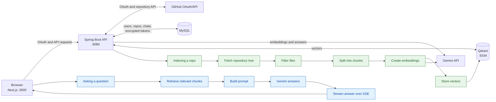

# GitPilot architecture

This diagram shows the browser, backend, external services, and the two main RAG paths: repository indexing and question answering.

```mermaid
flowchart LR
    B[Browser<br/>Next.js :3000] -->|OAuth and API requests| S[Spring Boot API<br/>:8080]
    S <-->|OAuth and repository API| G[GitHub OAuth/API]
    S <-->|users, repos, chats,<br/>encrypted tokens| M[(MySQL)]
    S -->|embeddings and answers| A[Gemini API]
    S <-->|vectors| Q[(Qdrant<br/>:6334)]

    S --> I1[Indexing a repo]
    I1 --> I2[Fetch repository tree]
    I2 --> I3[Filter files]
    I3 --> I4[Split into chunks]
    I4 --> I5[Create embeddings]
    I5 --> I6[Store vectors]
    I6 --> Q
    I5 --> A

    B --> Q1[Asking a question]
    Q1 --> Q2[Retrieve relevant chunks]
    Q2 --> Q3[Build prompt]
    Q3 --> Q4[Gemini answers]
    Q4 --> Q5[Stream answer over SSE]
    Q5 --> B

    classDef indexing fill:#e8f5e9,stroke:#2e7d32,color:#1b5e20;
    classDef asking fill:#e3f2fd,stroke:#1565c0,color:#0d47a1;
    class I1,I2,I3,I4,I5,I6 indexing;
    class Q1,Q2,Q3,Q4,Q5 asking;
```
